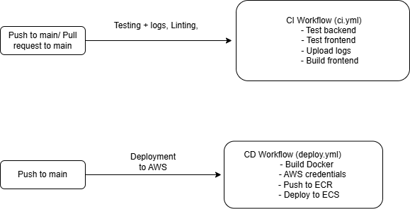

# Word Scramble

## What is this App?

A simple word scramble game, players will:
- See a scrambled word.
- Submit a guess.
- Receive feedback whether it is correct or not.

## Core features

Feature            | Description
---                | ---
Word Generation    | Random word selected and scrambled by backend.
Guess Submission   | User submits guess from frontend.
Result Feedback    | Correct/Incorrect shown
Replay             | Option to try new word.

## Application Architecture 

## API Endpoints

Method | Route     | Description
---    | ---       | ---
GET    | /api/word | Get a random scrambled word.
POST   | /api/guess| Submit a guess with session ID.

## Wireframes

 Correct guess

 Incorrect guess

## CI/CD (.github/workflows/ci.yml)

This workflow ensures that the application is tested and build-ready on every code push or pull request.

### Key Features

- Run automatically on:
  - Push to main
  - Pull request to main
  - Manual Trigger 
  
- Backend tests are run on Jest + Supertest
- All test logs are stored and uploaded as GitHub Actions artifacts

## CI/CD (.github/workflows/deploy.yml)

This deployment workflow is triggered on main pushes or manually, and handles the full release process.

### Key Features

- Builds Docker images for
  - client (React + Vite)
  - server (Express + Node.js)
- Tags both images v3
- Authenticates with Amazon ECR and pushes images
- Triggers Amazon ECS to force new deployments for 
  - word-scramble-client-service
  - word-scramble-api-service

## Tools and Services for CI/CD

Tool               | Purpose                                                | Justification
---                | ---                                                    |  ---
GitHub Actions     |  Implement workflow files                              |   Built in to GitHub and has simple yaml-based configuration, supports both CI/CD.
Docker             |  Containerisation of App                               |   Keeps all dependencies consistent across all environments
AWS ECR            |  Docker image hosting                                  |   Integrates easily with AWS ECS
GitHub Secrets     |  Secure credentials                                    |   Keeps AWS keys, repo URLs, and config safe and encrypted

## Future features

Feature                     |   Description
---                         |   ---
Time/score tracking         | Time how long it takes user to guess correct, and based on that gives a score, incorrect guesses reduce score.
Difficulty levels           | Scale in difficulty, users complete more levels and unlock more difficult levels
User Accounts               | Allow users to save scores with login
Word hints                  | Allow hints such as word definition and/or reveal letters
Leaderboard with Database   | Using MongoBD track user scores and place them on leader board compared to other users